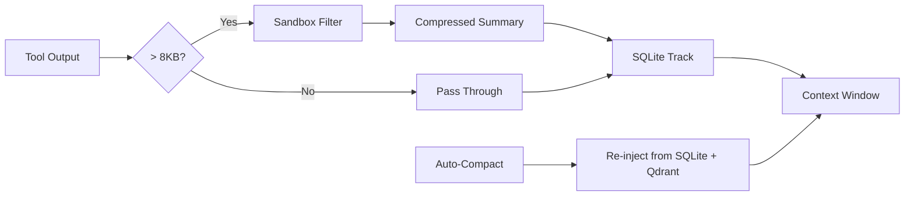

# Agent Instructions

> `CLAUDE.md`, `GEMINI.md`, `OPENCODE.md`, `COPILOT.md`, and `OPENCLAW.md` are symlinks to this file.
> Kiro reads `.kiro/steering/agents.md` (also a symlink here).
> The same instructions load in any AI coding agent environment.

---

## ⚡ Session Boot Protocol (MANDATORY)

**Run this ONCE at the start of every session, before any other work:**

```bash
python3 execution/session_boot.py --auto-fix
```

This single command checks Qdrant, Ollama, embedding models, and collections. If anything is missing, `--auto-fix` repairs it automatically. If the output shows `"memory_ready": true`, proceed normally. If it shows issues, follow the printed instructions.

**Why this matters:** The memory system provides 80-100% token savings on repeated work. Skipping this step means every query pays full token cost.

---

## Getting Started

### Installation

Run this command in any directory where you want to scaffold a new AI agent:

```bash
npx @techwavedev/agi-agent-kit init
```

### Dependencies

This toolkit relies on Python scripts for deterministic execution. Ensure you have the following installed:

1. **Python 3.8+**: `python3 --version`
2. **Pip Dependencies**:
   ```bash
   pip install requests beautifulsoup4 html2text lxml qdrant-client
   ```

### Updates

To update the kit to the latest version:

```bash
# Clear npx cache to force latest version download
rm -rf ~/.npm/_npx
npx @techwavedev/agi-agent-kit init
```

---

## Core Philosophy: Determinism Over Probability

LLMs are probabilistic, but business logic requires consistency. This system fixes that mismatch by **pushing complexity into deterministic code** and letting the agent focus on intelligent decision-making.

**Why it matters:** 90% accuracy per step = 59% success over 5 steps. The solution is to minimize probabilistic steps by delegating execution to reliable scripts.

---

## The 3-Layer Architecture

### Layer 1: Directives (Intent)

**Location:** `directives/`

Directives are SOPs written in Markdown that define:

- **Goal**: What needs to be accomplished
- **Inputs**: Required data, context, or parameters
- **Tools**: Which execution scripts to use
- **Outputs**: Expected deliverables and their format
- **Edge Cases**: Known failure modes and how to handle them

Think of directives as instructions you'd give a capable but literal-minded employee. They bridge human intent to machine execution.

```markdown
# Example: directives/scrape_competitor_pricing.md

## Goal

Scrape pricing data from competitor websites and compile into a comparison sheet.

## Inputs

- `competitors.json` - List of competitor URLs and selectors
- Target date range (optional, defaults to current)

## Execution

1. Run `execution/scrape_single_site.py` for each competitor
2. Run `execution/normalize_pricing.py` to standardize formats
3. Run `execution/export_to_sheets.py` to push to Google Sheets

## Outputs

- Google Sheet with pricing comparison (link in `.tmp/output_links.json`)
- Raw data preserved in `.tmp/scraped/`

## Edge Cases

- **Rate limiting**: Script auto-retries with exponential backoff (max 3 attempts)
- **Selector changes**: Log failure, continue with others, alert user at end
- **Auth required**: Skip site, note in output sheet
```

---

### Layer 2: Orchestration (Decision-Making)

**This is the agent's role.**

The agent is the intelligent router between intent and execution:

| Responsibility            | Description                                             |
| ------------------------- | ------------------------------------------------------- |
| **Read directives**       | Understand what needs to be done before acting          |
| **Sequence execution**    | Call scripts in the right order with correct parameters |
| **Handle errors**         | Diagnose failures and apply self-annealing (see below)  |
| **Ask for clarification** | When requirements are ambiguous, ask—don't guess        |
| **Update directives**     | Capture learnings to prevent future failures            |

**Critical principle:** The agent does NOT perform complex data transformations, API calls, or file operations directly. Instead, it invokes execution scripts that handle these deterministically.

```
❌ Wrong: Agent writes inline Python to scrape a website
✅ Right: Agent reads directive → invokes execution/scrape_single_site.py → handles result
```

---

### Layer 3: Execution (Deterministic Work)

**Location:** `execution/`

Python scripts that handle:

- API calls and external integrations
- Data processing and transformations
- File operations and I/O
- Database interactions
- Export to cloud services (Google Sheets, Slides, etc.)

**Script requirements:**

- Well-commented and self-documenting
- Accept clear inputs via CLI arguments or stdin
- Return structured output (JSON preferred) or exit codes
- Handle their own error cases gracefully
- Idempotent where possible (safe to retry)

```bash
# Example invocation
python execution/scrape_single_site.py \
  --url "https://competitor.com/pricing" \
  --selector ".price-table" \
  --output ".tmp/scraped/competitor_2024.json"
```

---

## Operating Principles

### 1. Memory-First (MANDATORY — NOT OPTIONAL)

**⚠️ ENFORCEMENT: The agent MUST actively use Qdrant + Ollama memory during EVERY session. This is not advisory — it is required. Failure to use memory during real tasks is a bug.**

**All operations use the Hybrid Memory System (Qdrant + BM25) by default.**

#### Session Start

See [Session Boot Protocol](#-session-boot-protocol-mandatory) above — run `session_boot.py --auto-fix` once per session.

#### Before Every Complex Task (MANDATORY)

You MUST run this before starting any non-trivial task:

```bash
python3 execution/memory_manager.py auto --query "<one-line summary of the task>"
```

**Decision tree based on output:**

| Result               | Action                                                                    |
| -------------------- | ------------------------------------------------------------------------- |
| `"cache_hit": true`  | Use cached response directly. Inform user: "Retrieved from memory cache." |
| `"source": "memory"` | Inject `context_chunks` into your reasoning. Cite them.                   |
| `"source": "none"`   | Proceed normally. Store the result when done.                             |

#### After Key Decisions or Solutions (MANDATORY)

You MUST store decisions, solutions, and learnings after completing work:

```bash
python3 execution/memory_manager.py store \
  --content "Description of what was decided/solved" \
  --type decision \
  --project <project-name> \
  --tags relevant-tag1 relevant-tag2
```

Memory types: `decision`, `code`, `error`, `technical`, `conversation`

**When to store (checklist — at least ONE per task):**

- ✅ You made an architecture or technology decision
- ✅ You wrote or fixed code that others could reuse
- ✅ You debugged and solved an error
- ✅ You discovered a technical insight or API quirk
- ✅ You completed a multi-step workflow

#### Handling Conversation Compaction (MANDATORY)

When you compact the chat or clear the context window to save tokens (such as when running `/compact` or automatically dropping early history), that context is permanently lost unless you explicitly save it. You MUST generate a summary of the vital context and push it to Qdrant immediately before the compaction:

```bash
python3 execution/memory_manager.py store \
  --content "Pre-compaction summary: <insert key context, decisions, and current state>" \
  --type conversation \
  --project <project-name>
```

#### After Completing a Complex Task

```bash
python3 execution/memory_manager.py cache-store \
  --query "The original user question" \
  --response "The complete response that was generated"
```

#### Session Close Protocol (MANDATORY)

At the end of a work session, run the wrap-up script to verify cleanup and formally commit all contextual learnings to the shared cross-agent memory:

```bash
python3 execution/session_wrapup.py --auto-broadcast
```

**What it does:**

1. **Reviews session activity** — queries Qdrant for memories stored in the last 60 minutes
2. **Verifies memory stores** — warns if zero decisions/learnings were stored (protocol violation)
3. **Broadcasts to all agents** — calls `cross_agent_context.py store` so other LLMs see what was accomplished
4. **Checks stale .tmp/ files** — lists files older than 24h for manual cleanup
5. **Updates Control Tower** — marks session as ended in the orchestrator

**Options:**

```bash
python3 execution/session_wrapup.py --agent gemini --project myapp --since 90 --json
```

**Exit codes:** 0 = clean wrapup, 1 = zero stores warning, 2 = memory unreachable

#### Proving Usage (Auditable)

To verify the agent is actually using memory:

```bash
# Quick check: recent stores?
python3 execution/memory_usage_proof.py --check --since 60

# Full audit report
python3 execution/memory_usage_proof.py --report
```

**Opt-out:** If the user says "don't use cache", "no cache", "skip memory", or "fresh" — skip `memory_manager.py auto` and `cache-store` calls for that task. Still run `session_boot.py` and `session_wrapup.py` (infrastructure health), but do not query or store task-specific memories.

> See `directives/memory_integration.md` for full protocol and token savings reference.

#### Cross-Agent Collaboration (Multi-LLM Context Sharing)

Multiple AI agents (Claude, Antigravity/Gemini, Cursor, etc.) share the **same Qdrant memory**. Use `execution/cross_agent_context.py` to coordinate:

```bash
# At session start: see what other agents have done
python3 execution/cross_agent_context.py sync --agent "<your-name>" --project <project>

# Check if anyone handed you a task
python3 execution/cross_agent_context.py pending --agent "<your-name>" --project <project>

# After completing work: share context with teammates
python3 execution/cross_agent_context.py store --agent "<your-name>" --action "What you did" --project <project>

# Hand off a task to another agent
python3 execution/cross_agent_context.py handoff --from "<your-name>" --to "<target>" --task "Task description" --project <project>

# Broadcast to ALL agents (breaking changes, major decisions)
python3 execution/cross_agent_context.py broadcast --agent "<your-name>" --message "Team-wide update" --project <project>

# Team status overview
python3 execution/cross_agent_context.py status --project <project>
```

**Agent names:** `antigravity`, `claude`, `gemini`, `cursor`, `copilot`, `opencode`, `openclaw`

**Rules:**
- At session start, run `sync` + `pending` to see teammates' work and pending handoffs
- After key decisions, `store` your context so other agents stay informed
- Use `handoff` when a task needs another agent's attention
- Use `broadcast` for breaking changes or decisions that affect all agents
- See `directives/multi_llm_collaboration.md` for full collaboration patterns

### 2. Check for Existing Tools First

Before writing any new script:

1. **Check `execution/`** for existing scripts that might handle the task
2. **Review the relevant directive** to see if a workflow already exists
3. **Search Knowledge Items** for documented patterns and learnings

Only create new scripts when truly necessary. Reuse and extend existing tools.

### 3. Local-First Routing (Security + Token Savings)

**Principle:** Small deterministic tasks run on local Ollama models (Gemma 4, GLM). Security-sensitive tasks (secrets, tokens, credentials) MUST stay local — never sent to cloud APIs. **Performance-first rule:** Never sacrifice output quality for token savings — if a task needs deep reasoning, it MUST go to cloud.

#### Task Router (auto-classification)

```bash
# Classify a task → local, local_required, or cloud
python3 execution/task_router.py classify --task "Extract the API key from .env"

# Route and execute (local tasks run immediately, cloud returns delegation)
python3 execution/task_router.py route --task "Convert getUserData to snake_case"

# Split compound tasks into independently-routable subtasks
python3 execution/task_router.py split --task "1) Read .env 2) summarize the log 3) architect caching"

# Routing statistics
python3 execution/task_router.py stats
```

#### Task Classification Matrix

| Route | When | Examples | Model |
|-------|------|----------|-------|
| `local_required` | Secrets, credentials, .env, tokens, passwords, private keys | Parse .env, extract API key, read credentials.json, check token format | `gemma4:e4b` |
| `local` | Simple deterministic tasks that don't need deep reasoning | Summarize error log, classify text, convert naming convention, format JSON, count lines, extract fields | `gemma4:e4b` → `glm-4.7-flash` fallback |
| `cloud` | Complex reasoning, multi-file understanding, architecture | Design system, refactor module, review PR, debug complex issue, implement feature, write documentation | Cloud LLM (Claude, Gemini, etc.) |

**Decision tree:**

```
Is this task security-sensitive (secrets, .env, credentials)?
  YES → local_required (NEVER cloud, even if local fails → BLOCKED)
  NO  → Is it simple + deterministic (summarize, classify, format, extract, parse)?
    YES → Can Gemma4 handle it without quality loss?
      YES → local (free tokens)
      NO  → cloud (quality over savings)
    NO  → cloud (needs deep reasoning)
```

**Key rule:** When in doubt, err on the side of **cloud for quality** and **local for security**. The savings from routing simple tasks locally add up (80-100% on repeated work), but a bad answer from a weak model costs more than the tokens saved.

#### Local Micro Agent (execution)

```bash
# Direct invocation
python3 execution/local_micro_agent.py --task "Summarize this error" --input-file error.log

# Force a specific model
python3 execution/local_micro_agent.py --task "Classify this text" --model glm-4.7-flash

# Health check
python3 execution/local_micro_agent.py health
```

**Model registry:** `gemma4:e4b` (fast tier, 4B) → `glm-4.7-flash` (medium tier, 12B). Automatic fallback chain if preferred model fails.

**Agent protocol:** Before delegating any task to a sub-agent, the orchestrator SHOULD run `task_router.py classify` to check if it can be handled locally. For batch operations, use `task_router.py split` to decompose compound tasks and route each subtask independently.

#### What Local Models Handle Well (concrete examples)

- ✅ `"Read .env and extract the DATABASE_URL value"` → `local_required`
- ✅ `"Summarize this 50-line error stack trace"` → `local`
- ✅ `"Convert camelCase function names to snake_case"` → `local`
- ✅ `"Parse this JSON and extract the 'status' field"` → `local`
- ✅ `"Classify this log entry as error/warning/info"` → `local`
- ✅ `"Count the number of TODO comments in this file"` → `local`
- ❌ `"Refactor the auth module to use JWT"` → `cloud` (needs deep reasoning)
- ❌ `"Review this PR for security issues"` → `cloud` (needs context awareness)
- ❌ `"Design a caching strategy for this API"` → `cloud` (needs architecture thinking)

### 4. Self-Anneal When Things Break

Errors are learning opportunities, not failures. When something breaks:

```
┌─────────────────────────────────────────────────────────┐
│  ERROR DETECTED                                         │
│  ↓                                                      │
│  1. Read error message and full stack trace             │
│  ↓                                                      │
│  2. Diagnose root cause                                 │
│  ↓                                                      │
│  3. Fix the script or adjust parameters                 │
│  ↓                                                      │
│  4. Test the fix (⚠️ confirm with user if uses paid    │
│     tokens, credits, or has side effects)               │
│  ↓                                                      │
│  5. Update directive with what was learned              │
│  ↓                                                      │
│  SYSTEM IS NOW STRONGER                                 │
└─────────────────────────────────────────────────────────┘
```

**Example:** You hit an API rate limit → investigate API docs → find batch endpoint → rewrite script to use batching → test → update directive with rate limit info and new approach.

### 5. Update Directives as You Learn

Directives are **living documents**. Update them when you discover:

- API constraints or rate limits
- Better approaches or optimizations
- Common errors and their solutions
- Timing expectations (how long things take)
- New edge cases

**Rules:**

- Always ask before creating or overwriting directives (unless explicitly told to proceed)
- Append learnings to existing directives rather than replacing content
- Date your additions for future reference

### 6. Validate Before Delivering

Before marking a task complete:

- Verify outputs exist and are accessible
- Spot-check data quality where possible
- Confirm deliverables are in the expected location (cloud service, output file, etc.)

### 7. Release Governance Protocol (MANDATORY)

**Before merging to `public` branch or publishing to NPM, YOU MUST:**

1.  **Execute the Release Gate**:

    ```bash
    python3 .agent/scripts/release_gate.py
    ```

    This validates:
    - Documentation (README/CHANGELOG) presence & updates
    - Security (Secret scanning)
    - Code Syntax (Python/JS)
    - Version Consistency (package.json vs CHANGELOG)
    - Git Status (Clean working tree)

2.  **Verify Workflow**:
    - Review `.agent/workflows/release-protocol.md` for manual steps.
    - Ensure `AGENTS.md` and `memory_integration.md` are up-to-date with code.

3.  **Publish via Script**:
    - Do NOT run `npm publish` manually.
    - Run `npm run prepublishOnly` (or relying on the lifecycle hook) to enforce the gate.

**ZERO TOLERANCE:** Never bypass the Release Gate. If it fails, FIX the issue. Do not force push.

---

## File Organization

### Directory Structure

```
project/
├── .agent/
│   └── workflows/        # Quick-reference workflows for common tasks
├── .env                  # Environment variables and API keys
├── .gitignore            # Excludes credentials and .tmp/
├── .tmp/                 # Intermediate files (always regenerable)
│   ├── scraped/          # Raw scraped data
│   ├── processed/        # Transformed data
│   └── output_links.json # Links to cloud deliverables
├── credentials.json      # Google OAuth credentials
├── token.json            # Google OAuth token
├── directives/           # SOPs in Markdown
├── docs/                 # Project documentation, guides, and references
│   ├── guides/           # How-to guides and tutorials
│   ├── api/              # API references and specifications
│   └── architecture/     # System design and architecture docs
├── execution/            # Deterministic Python scripts
├── skill-creator/        # Skill creation toolkit (use to create new skills)
├── skills/               # Modular capabilities (PDF reading, web scraping, etc.)
│   └── <skill-name>/
│       ├── SKILL.md      # Skill instructions and triggers
│       ├── scripts/      # Executable tools
│       ├── references/   # Documentation loaded on-demand
│       └── eval/         # Binary assertions for self-improvement (evals.json)
└── AGENTS.md             # This file (symlinked as CLAUDE.md, GEMINI.md)
```

### Skills

Skills are modular packages that extend agent capabilities with specialized workflows, scripts, and domain knowledge. Each skill contains:

- **SKILL.md** — Instructions with YAML frontmatter (`name`, `description`) for triggering. **Must be under 200 lines.** Use progressive disclosure by linking to reference files.
- **scripts/** — Deterministic tools the agent can execute
- **references/** — Documentation loaded only when needed (to prevent token bloat)

**Key Resources:**

- **Skills Catalog:** `skills/SKILLS_CATALOG.md` — Complete documentation of all available skills
- **Skill Creator Guide:** `skill-creator/SKILL_skillcreator.md` — How to create new skills

**Progressive Disclosure Rules (MANDATORY):**

- `SKILL.md` MUST be under 200 lines — it is a process router, not an encyclopedia
- Put step-by-step instructions, output formatting, and routing logic in `SKILL.md`
- Put deep knowledge, long examples, brand context, and frameworks in `references/`
- Claude loads reference files only when `SKILL.md` explicitly tells it to, then unloads them
- YAML frontmatter MUST include `name` (hyphen-case) and `description` (trigger conditions)

**Commands:**

```bash
# Create a new skill
python3 skill-creator/scripts/init_skill.py <name> --path skills/

# Update the skills catalog (MANDATORY after any skill change)
python3 skill-creator/scripts/update_catalog.py --skills-dir skills/

# Evaluate a skill against structural criteria (Skills 2.0)
python3 skill-creator/scripts/evaluate_skill.py \
  --skill-path skills/<name> \
  --test-input "test prompt" \
  --criteria '["SKILL.md exists", "Has YAML frontmatter", "Under 200 lines", "Has references/ directory"]'
```

The evaluation stores results in Qdrant for cross-agent visibility and tracks historical pass rates.

### Deliverables vs. Intermediates

| Type              | Location       | Examples                                              |
| ----------------- | -------------- | ---------------------------------------------------- |
| **Deliverables**  | Cloud services | Google Sheets, Slides, Drive files, database records |
| **Intermediates** | `.tmp/`        | Scraped HTML, processed JSON, temp exports           |

**Key principle:** Everything in `.tmp/` can be deleted and regenerated. Deliverables live in the cloud where users can access them.

---

## Integration with Agent Tools

Use your environment's native tools to interact with the project. The mappings below cover common agent environments:

| Action | Claude Code | Windsurf / Cursor | Generic |
|--------|------------|-------------------|---------|
| Read files | `Read` tool | `view_file` | `cat` / `read` |
| Search content | `Grep` tool | `grep_search` | `grep` / `rg` |
| Find files | `Glob` tool | `find_by_name` | `find` / `ls` |
| Run scripts | `Bash` tool | `run_command` | shell exec |
| Edit files | `Edit` tool | `replace_file_content` | `sed` / patch |
| Write files | `Write` tool | `write_to_file` | redirect / `tee` |

- Read directives before starting work
- Capture script output and exit codes for decision-making
- Create new workflows in `.agent/workflows/` for repeatable processes

---

## Workflow Quick Reference

For frequently-used processes, create workflows in `.agent/workflows/`:

```markdown
# .agent/workflows/refresh-pricing.md

---

description: Refresh competitor pricing data and update comparison sheet
---

1. Verify `.env` contains required API keys
2. Run `python execution/scrape_all_competitors.py`
   // turbo
3. Run `python execution/normalize_pricing.py --input .tmp/scraped/ --output .tmp/processed/`
   // turbo
4. Run `python execution/export_to_sheets.py --input .tmp/processed/pricing.json`
5. Verify Google Sheet is updated and share link with user
```

> **Note:** Steps marked with `// turbo` can be auto-run. Use `// turbo-all` at the top to auto-run all command steps.

---

## Playbook Engine (Multi-Skill Sequences)

For complex, multi-step tasks, use **playbooks** — pre-defined sequences of skills that guide you through a complete workflow with progress tracking.

### How It Works

Playbooks are defined in `data/workflows.json`. Each playbook is a sequence of steps, and each step recommends specific skills to use. The Workflow Engine (`execution/workflow_engine.py`) manages state, tracks progress, and tells you which skills to activate at each step.

### Quick Start

```bash
# 1. See available playbooks
python3 execution/workflow_engine.py list

# 2. Start a playbook
python3 execution/workflow_engine.py start ship-saas-mvp

# 3. The engine shows Step 1 with recommended skills — execute them

# 4. When step is done, mark it complete and get next step
python3 execution/workflow_engine.py complete --notes "Planned scope with brainstorming skill"

# 5. Check overall progress at any time
python3 execution/workflow_engine.py status
```

### Agent Protocol for Playbooks

When a user says `/playbook`, "run a playbook", or asks for a multi-step workflow:

1. **List playbooks**: `python3 execution/workflow_engine.py list`
2. **Ask the user** which playbook to run (or auto-select if the intent is clear)
3. **Start it**: `python3 execution/workflow_engine.py start <id>`
4. **For each step**:
   a. Read the step's `goal` and `recommendedSkills` from the engine output
   b. Read the relevant `SKILL.md` files for the recommended skills
   c. Execute the step using those skills' instructions
   d. Mark complete: `python3 execution/workflow_engine.py complete --notes "what was done"`
5. **If a step is not applicable**, skip it: `python3 execution/workflow_engine.py skip --reason "why"`
6. **If a step partially succeeds**, mark it complete with notes on what remains: `--notes "Done X, still needs Y"` — the next step or user can pick up the remainder
7. **If the user wants to stop**, abort: `python3 execution/workflow_engine.py abort`

### Commands Reference

| Command    | Description                             | When to Use                  |
| ---------- | --------------------------------------- | ---------------------------- |
| `list`     | Show all available playbooks            | User asks "what playbooks?"  |
| `start`    | Begin a playbook, get Step 1            | User selects a playbook      |
| `next`     | Show current step details               | Need to re-read current step |
| `status`   | Show progress bar and step statuses     | User asks "where are we?"    |
| `complete` | Mark current step done, advance to next | Step work is finished        |
| `skip`     | Skip current step with reason           | Step not applicable          |
| `abort`    | Cancel the active playbook              | User wants to stop           |

> **State persistence:** Progress is saved in `.tmp/playbook_state.json`. If a session ends mid-playbook, the next session can resume with `python3 execution/workflow_engine.py next`.

> **Skill availability:** The engine checks which recommended skills are actually installed and flags missing ones with ⚠️ so you can adapt.

---

## Skill Self-Improvement (Karpathy Loop)

Skills can autonomously improve their quality using the **Karpathy Loop** — an iterative cycle of test → change → eval → commit/reset.

> Inspired by Andrej Karpathy's "auto-research" concept. See `skill-creator/SKILL_skillcreator.md` Step 8 for full methodology.

### Quick Start

```bash
# Check current skill quality
python3 execution/run_skill_eval.py --evals skills/my-skill/eval/evals.json --verbose

# See failing assertions for a skill
python3 execution/karpathy_loop.py --skill skills/my-skill --status-only

# Run autonomous improvement loop
python3 execution/karpathy_loop.py --skill skills/my-skill --max-iterations 10
```

### How It Works

1. Each skill has `eval/evals.json` with **binary assertions** (true/false only)
2. `run_skill_eval.py` runs assertions and reports pass rate
3. `karpathy_loop.py` orchestrates: agent edits SKILL.md → run evals → `git commit` if improved, `git reset` if not
4. Loop continues until perfect score or max iterations

### Assertion Types

`contains`, `not_contains`, `max_words`, `min_words`, `max_lines`, `min_lines`, `regex_match`, `regex_not_match`, `starts_with`, `ends_with`, `has_yaml_frontmatter`, `no_consecutive_blank_lines`, `max_chars`, `min_chars`, `contains_all`, `contains_any`, `line_count_equals`, `no_trailing_whitespace`

### Key Rule

Only use **binary assertions** — never subjective. `"max_words": 300` ✅, "Is the text good?" ❌.

---

## Best Practices for Directives and Markdown (Token Optimization)

Markdown files containing instructions, SOPs, and documentation (`.md`) are fed directly into the model's context window. **Long, extended markdown files waste precious tokens and dilute the agent's focus**, making it less effective.

### Rules for Markdown Conciseness:

1. **Keep it Short**: Challenge every sentence. Assume the agent already knows standard patterns — don't explain them.
2. **Modularize Large Files**: Over 1,500 words or 10KB? Split into smaller files with parent-child references.
3. **Prefer Examples Over Prose**: Input/output examples beat verbose descriptions.
4. **Remove Filler**: No conversational filler, no redundant instructions, no obvious statements.
5. **Use Mermaid Context Compression**: Replace verbose architecture/workflow descriptions with Mermaid diagrams (hundreds of tokens vs. thousands). Example:

   ```mermaid
   graph LR
     A[Input] --> B[Process] --> C[Validate] --> D[Store] --> E[Output]
   ```

---

## Context Mode (Token Saving & Session Persistence)

Context Mode dramatically extends session lifespan by sandbox-filtering heavy tool outputs and persisting session state in SQLite + Qdrant. Hooks auto-intercept tool calls so the system works transparently.



### Quick Start

```bash
# Manual init (hooks auto-init on SessionStart)
python3 execution/context_mode.py init --session-id my-session --project myapp

# Track a decision
python3 execution/context_mode.py track --type decision --content "Chose X" --priority high

# Track heavy data with sandbox filtering
python3 execution/context_mode.py track --type file_read --content "..." --sandbox

# Token savings dashboard
python3 execution/context_mode.py status

# Re-inject context after compaction
python3 execution/context_mode.py reinject --max-tokens 2000

# Export session to Qdrant
python3 execution/context_mode.py export
```

### Hooks (Auto-Configured)

Hooks in `.claude/settings.json` auto-intercept tool calls:

| Hook | Event | Purpose |
|------|-------|---------|
| `context_session_start.py` | `SessionStart` | Auto-init SQLite session |
| `context_filter.py` | `PostToolUse` | Sandbox-filter Read/Grep/Bash/Glob/WebFetch outputs > 8KB |
| `context_reinject.py` | `PreCompact` | Re-inject critical context before compaction |

### Environment Variables

| Variable | Default | Purpose |
|----------|---------|---------|
| `CTX_COMPRESSION_THRESHOLD` | `8192` | Bytes threshold for sandbox filtering |
| `CTX_REINJECT_TOKENS` | `2000` | Max tokens for re-injection payload |
| `CTX_QDRANT_PERSIST` | `false` | Also store filtered context in Qdrant |
| `CTX_AGENT` | `claude` | Agent name for session tracking |
| `CTX_PROJECT` | `agi-agent-kit` | Project name for session tracking |

### Self-Correcting Memory Loop (learnings.md)

Skills self-improve via accumulated feedback:

```bash
# Log a learning after a failure or correction
python3 execution/learnings_engine.py log --skill brainstorming --learning "Keep under 500 words" --severity warning

# Read learnings before executing a skill
python3 execution/learnings_engine.py read --skill brainstorming

# Apply learnings to SKILL.md (rewrites the file)
python3 execution/learnings_engine.py apply --skill brainstorming

# Apply all accumulated learnings at session end
python3 execution/learnings_engine.py apply-all

# Sync learnings to Qdrant
python3 execution/learnings_engine.py sync
```

**Agent protocol:** Before executing any skill, read its learnings. After any failure or user correction, log the learning. `session_wrapup.py` auto-applies and syncs at session end.

---

## Best Practices for Execution Scripts

### Script Template

```python
#!/usr/bin/env python3
"""
Script: script_name.py
Purpose: Brief description of what this script does

Usage:
    python script_name.py --input <file> --output <file> [--verbose]

Arguments:
    --input   Path to input file (required)
    --output  Path to output file (required)
    --verbose Enable detailed logging (optional)

Exit Codes:
    0 - Success
    1 - Invalid arguments
    2 - Input file not found
    3 - API/Network error
    4 - Processing error
"""

import argparse
import json
import sys
from pathlib import Path

def main():
    parser = argparse.ArgumentParser(description=__doc__)
    parser.add_argument('--input', required=True, help='Input file path')
    parser.add_argument('--output', required=True, help='Output file path')
    parser.add_argument('--verbose', action='store_true', help='Verbose output')
    args = parser.parse_args()

    # Your logic here
    try:
        result = process(args.input)
        Path(args.output).write_text(json.dumps(result, indent=2))
        print(json.dumps({"status": "success", "output": args.output}))
        sys.exit(0)
    except Exception as e:
        print(json.dumps({"status": "error", "message": str(e)}), file=sys.stderr)
        sys.exit(4)

if __name__ == '__main__':
    main()
```

### Naming Conventions

| Type       | Convention            | Example                                      |
| ---------- | --------------------- | -------------------------------------------- |
| Scripts    | `verb_noun.py`        | `scrape_website.py`, `export_to_sheets.py`   |
| Directives | `noun_or_task.md`     | `competitor_analysis.md`, `weekly_report.md` |
| Temp files | Descriptive with date | `.tmp/scraped/competitor_2024-01-19.json`    |

---

## Error Handling Patterns

### In Scripts

```python
# Always return structured errors
try:
    result = risky_operation()
except RateLimitError as e:
    print(json.dumps({
        "status": "rate_limited",
        "retry_after": e.retry_after,
        "message": str(e)
    }))
    sys.exit(3)
except Exception as e:
    print(json.dumps({
        "status": "error",
        "type": type(e).__name__,
        "message": str(e)
    }))
    sys.exit(4)
```

### As the Agent

When a script returns an error:

1. Parse the structured error output
2. Determine if it's recoverable (rate limit → wait and retry) or fatal (auth error → ask user)
3. Apply the fix or escalate to the user
4. **Update the directive** with the failure mode and solution

---

## Agent Teams Protocol

> See `docs/agent-teams/README.md` for full reference and mandatory rules.

### What Are Team Agents?

A **team agent** is a named group of sub-agents that collaborate toward a shared goal. Teams are defined in `directives/teams/`. 

Starting with v1.7.7, the framework uses a **Native Agent Runtime** to manage these teams without relying on external Node CLIs. 
- **Simple Tasks:** Are automatically routed to `local_micro_agent.py` running locally on Ollama.
- **Complex Tasks:** Are delegated back to *you*, the active orchestrator session (Claude, Antigravity, Copilot, etc.) via In-Context Delegation, so no external cloud API keys are expended.

Dispatch teams using the native runtime execution flag:

```bash
python3 execution/dispatch_agent_team.py --team <team_id> --payload '<json>' --execute-native
```

> **Mandatory Rule:** When a sub-agent task returns `"status": "delegated_to_active_session"`, you MUST immediately open the provided `delegation_file` and execute its instructions natively as the specified persona.

### Dynamic State Handoff (Agent Communication)

Sub-agents execute sequentially based on the manifest, but they can pass context to the next agent in line, or to remote agents executing in parallel.
- If a sub-agent completes part of a task, it should output a `handoff_state` object in its resulting JSON.
- This object **MUST** contain three core elements:
  - `state`: The data or file paths to pass.
  - `next_steps`: Instructions specifically for the next agent.
  - `validation_requirements`: What the next agent must test or verify about this agent's work.
- The Primary Agent (Orchestrator) **MUST** actively verify this handoff plan and:
  1. Store it as raw JSON to Qdrant memory using `python3 execution/memory_manager.py store` tagged with the team's run ID.
  2. Pass it directly to the next local sub-agent as part of their context payload so they can execute the validation precisely.
- This allows Agent A to say *"I finished steps 1-3. Here are the files. Agent B, you MUST run this specific test command to validate my syntax, and then proceed to step 4."*

### Available Teams

| Team | Purpose |
|------|---------|
| `documentation_team` | Updates docs + CHANGELOG on every code change |
| `code_review_team` | Two-stage review: spec compliance → code quality |
| `qa_team` | Generate tests + verify they pass |

### ⚠️ MANDATORY: Documentation Team on Every Code Change

After ANY code change to `execution/`, `skills/`, `templates/`, or `directives/`, you MUST dispatch the documentation team before marking the task complete:

```bash
python3 execution/dispatch_agent_team.py \
  --team documentation_team \
  --payload '{"changed_files": ["<list>"], "commit_msg": "<msg>", "change_type": "feat|fix|refactor|docs|chore"}'
```

Then invoke each sub-agent in the manifest in order:
1. `doc-writer` — reads `directives/subagents/doc_writer.md`
2. `doc-reviewer` — reads `directives/subagents/doc_reviewer.md`
3. `changelog-updater` — reads `directives/subagents/changelog_updater.md`

**Tasks are not complete until the documentation team has run and passed.**

### Parallel Dispatch with Worktree Isolation

When sub-agents can work independently (different files), use `--parallel` to give each its own git worktree:

```bash
# Parallel mode: each sub-agent gets isolated worktree
python3 execution/dispatch_agent_team.py \
  --team my_team \
  --payload '{"task": "..."}' \
  --parallel \
  --partitions '{"agent-1": ["src/api/**"], "agent-2": ["tests/**"]}' \
  --execute-native
```

**How it works:**

```
Orchestrator
  ├─ validate-partitions (ensure no file overlap)
  ├─ create-all worktrees (one per sub-agent, separate branch each)
  ├─ dispatch sub-agents IN PARALLEL (each in its own directory)
  ├─ merge-all (sequential merge back to source branch)
  └─ cleanup (remove worktrees + branches)
```

**Worktree isolator commands:**

```bash
python3 execution/worktree_isolator.py create --agent <name> --run-id <id>
python3 execution/worktree_isolator.py merge --agent <name> --run-id <id>
python3 execution/worktree_isolator.py merge-all --run-id <id>
python3 execution/worktree_isolator.py cleanup --agent <name> --run-id <id>
python3 execution/worktree_isolator.py status [--run-id <id>]
python3 execution/worktree_isolator.py validate-partitions --partitions '<json>'
```

**Claude Code native support:** Use `isolation: "worktree"` on the Agent tool to auto-create an isolated worktree per subagent.

**Key rules:**
- Always validate file partitions before parallel dispatch
- `.env` files are auto-copied to each worktree
- Merge branches back sequentially (first-come-first-merged)
- Never push worktree branches directly to main — use named branches + PRs

### Pattern Reference

| Pattern | When to Use | How |
|---------|-------------|-----|
| Single sub-agent (sequential) | Independent task + two-stage review | `code_review_team` |
| Parallel sub-agents (worktree) | 2+ independent domains, different files | `--parallel` flag on dispatch |
| Doc-team-on-code | After any code change | `documentation_team` (always) |
| Full pipeline | Release-quality flow | `code_review_team` → `documentation_team` → `qa_team` |

### Testing Agent Team Support

```bash
# Run all 5 test scenarios
python3 execution/run_test_scenario.py --all

# Or use the workflow
# Read: .agent/workflows/run-agent-team-tests.md
```

---

## Cloud Automation (Cowork, Cloud Tasks, Channels)

> See `directives/cloud_automation.md` for full SOP.

The framework integrates with Claude's cloud-native features for full automation without human interaction:

| Tier | Tool | When | How |
|------|------|------|-----|
| Local | Worktrees + `/loop` | Terminal-based, parallel agents | `worktree_isolator.py`, `/loop 10m <task>` |
| Cowork | Desktop VM agent | Skills + file ops + connectors | `cowork-export` skill, Dispatch from phone |
| Cloud | Cloud Tasks (24/7) | Critical scheduled runs | `claude.ai/code` web UI |
| Remote | Channels (Telegram) | Phone → terminal control | `/plugin install telegram` |

### Cowork Integration

```bash
# Export context + task to Cowork (clipboard)
python3 skills/cowork-export/scripts/export_context.py \
  --project agi-agent-kit \
  --task "Build a new automation project with these specs" \
  --include-files CLAUDE.md \
  --clipboard

# Track the handoff in Qdrant
python3 execution/cross_agent_context.py handoff \
  --from "claude" --to "cowork" \
  --task "Build automation project" \
  --project agi-agent-kit
```

### Full Automation Patterns

1. **Hands-free dev cycle**: Cloud Task (nightly tests) → Cowork (morning briefing) → Local agent (implement) → Cowork (review)
2. **Mobile dispatch**: Phone → Cowork Dispatch → Desktop executes → Phone gets summary
3. **Project bootstrap**: Export spec → Cowork builds full project → Pull back locally

---

## Framework Self-Development (Dogfooding)

When working on the AGI Agent Kit framework itself, use its own system:

### Key Directives

| Directive | Purpose |
|-----------|---------|
| `directives/framework_development.md` | SOP for coding the public framework |
| `directives/template_sync.md` | Keeping root ↔ templates/base/ in sync |
| `directives/skill_development.md` | Creating/updating/testing skills |
| `directives/multi_llm_collaboration.md` | Multi-LLM collaboration via Qdrant |
| `directives/cloud_automation.md` | Cloud Tasks, Cowork, Channels, full automation |

### Key Workflows

| Workflow | Purpose |
|----------|---------|
| `.agent/workflows/sync-templates.md` | Sync root → templates/base/ |
| `.agent/workflows/add-skill.md` | End-to-end skill creation |
| `.agent/workflows/update-execution-script.md` | Modify execution scripts safely |
| `.agent/workflows/upstream-sync.md` | Pull upstream fork updates |
| `.agent/workflows/publish-npm.md` | Full NPM release workflow |
| `.agent/workflows/cross-agent-collab.md` | Multi-LLM collaboration protocol |

### Key Scripts

```bash
# Check root ↔ template drift
python3 execution/sync_to_template.py --check

# Sync root files to template
python3 execution/sync_to_template.py --sync

# Validate template integrity
python3 execution/validate_template.py

# Cross-agent: broadcast to all LLMs
python3 execution/cross_agent_context.py broadcast --agent "<name>" --message "<msg>" --project agi-agent-kit

# Cross-agent: check pending handoffs
python3 execution/cross_agent_context.py pending --agent "<name>" --project agi-agent-kit

# Skill eval: run binary assertions
python3 execution/run_skill_eval.py --evals skills/<skill>/eval/evals.json --verbose

# Skill self-improvement: Karpathy Loop
python3 execution/karpathy_loop.py --skill skills/<skill> --status-only

# Task router: classify, route, split
python3 execution/task_router.py classify --task "Extract API key from .env"
python3 execution/task_router.py route --task "Summarize this error" --input-file error.log
python3 execution/task_router.py split --task "1) read .env 2) summarize log 3) architect cache"

# Local micro agent: run small tasks on Ollama
python3 execution/local_micro_agent.py --task "Convert to snake_case: getUserData" --raw
python3 execution/local_micro_agent.py health

# Dependency tracker: scan for vulnerabilities
python3 execution/dependency_tracker.py scan
python3 execution/dependency_tracker.py check --package axios --version 1.7.9 --ecosystem npm

# Claude native config: enable agent teams, model overrides
python3 execution/claude_native_config.py status
python3 execution/claude_native_config.py enable-teams
```

### MCP Servers

Two MCP servers expose the framework to Claude Desktop, Antigravity, Cursor, Copilot, and any MCP client:

| Server | File | Scope |
|---|---|---|
| `agi-framework` | `execution/mcp_server.py` | Memory + cross-agent + health (13 tools) |
| `qdrant-memory` | `skills/qdrant-memory/mcp_server.py` | Direct Qdrant skill ops (6 tools) |

> See `docs/mcp-compatibility.md` for full setup, config examples, and compatibility matrix.

### Rules

See `.agent/rules/versioning_rules.md` and `directives/framework_development.md` — enforces root-is-source-of-truth, mandatory sync, private file protection.

---

## Summary

You are the intelligent orchestrator between human intent (directives) and deterministic execution (Python scripts). Your role is to:

1. **Remember** — Query Qdrant memory BEFORE starting work (mandatory)
2. **Understand** what needs to be done by reading directives
3. **Execute** by calling the right scripts in the right order
4. **Adapt** by handling errors and edge cases gracefully
5. **Learn** by storing decisions/solutions in Qdrant memory (mandatory)
6. **Deliver** by ensuring outputs reach their intended destination

**Memory usage is not optional.** Every session should show actual Qdrant reads and writes. Use `python3 execution/memory_usage_proof.py --check` to verify.

**Be pragmatic. Be reliable. Self-anneal.**
