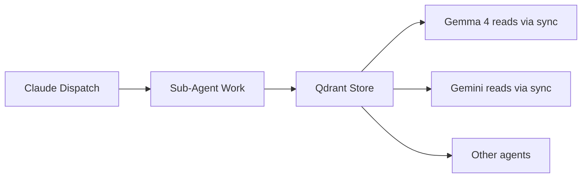

# Claude Code Native Dispatch

## Goal

Translate standard agent team manifests into Claude Code-native instructions, enabling true parallel subagent spawning via the Agent tool, worktree isolation, and cloud scheduling.

## When to Use

| Scenario | Mode | Command |
|----------|------|---------|
| Orchestrating from Claude Code (local) | `native` | `--mode native` (default) |
| Orchestrating from non-Claude agent | `fallback` | `--mode fallback` |
| Scheduling for cloud/remote execution | `schedule` | `--mode schedule` or `--cloud` |

**Auto-detection:** If `CLAUDE_CODE` or `CLAUDE_SESSION_ID` env vars are set, `dispatch_agent_team.py --claude` auto-pipes through the adapter. Override with `--no-claude`.

## Detection Logic

```
CLAUDE_CODE env var set?        → yes → native mode
CLAUDE_SESSION_ID env var set?  → yes → native mode
`claude` CLI in PATH?           → yes → native mode (weak signal)
None detected                   → fallback mode + warning
```

## Dispatch Modes

### Native Mode (default)

Outputs a JSON array of `agent_calls` for the Claude Code Agent tool:

```bash
python3 execution/claude_dispatch.py \
  --team documentation_team \
  --payload '{"changed_files": ["execution/foo.py"], "commit_msg": "feat: foo"}'
```

Each agent call includes:
- Complete prompt with directive content, payload, memory commands
- `isolation: "worktree"` for parallel teams
- `subagent_type: "general-purpose"`
- Cross-agent context commands (Qdrant stores for Gemma 4 visibility)

### Fallback Mode

Returns the standard manifest from `dispatch_agent_team.py` unchanged:

```bash
python3 execution/claude_dispatch.py --team qa_team \
  --payload '{"task": "run tests"}' --mode fallback
```

### Schedule Mode

Generates self-contained prompts for `/schedule` cloud dispatch:

```bash
python3 execution/claude_dispatch.py --team security_team \
  --payload '{"scan_type": "full"}' --mode schedule
```

Cloud prompts include `session_boot.py` setup since cloud tasks run in fresh clones.

## Integration with dispatch_agent_team.py

```bash
# Auto-detects Claude Code and pipes through adapter
python3 execution/dispatch_agent_team.py \
  --team documentation_team \
  --payload '{"changed_files": ["execution/foo.py"], "commit_msg": "feat: foo"}' \
  --claude

# Force standard output even in Claude Code
python3 execution/dispatch_agent_team.py \
  --team documentation_team \
  --payload '...' \
  --no-claude
```

## Cross-Agent Context (Qdrant)

Every dispatch stores context so other LLMs (Gemma 4, Gemini, Cursor) can see:



Each sub-agent prompt includes mandatory commands:
1. `memory_manager.py auto` -- query before starting
2. `memory_manager.py store` -- store results after completion
3. `cross_agent_context.py store` -- share with other LLMs

Tags used: `claude-dispatch`, `native-dispatch`, `<team_id>`, `<subagent_id>`

## Team Dispatch Examples

### documentation_team

```bash
python3 execution/claude_dispatch.py --team documentation_team \
  --payload '{"changed_files": ["execution/claude_dispatch.py"], "commit_msg": "feat: add claude dispatch", "change_type": "feat"}'
```

### code_review_team

```bash
python3 execution/claude_dispatch.py --team code_review_team \
  --payload '{"task_spec": "Implement X", "changed_files": ["src/x.py"], "task_id": "TASK-1"}'
```

### qa_team

```bash
python3 execution/claude_dispatch.py --team qa_team \
  --payload '{"test_scope": "execution/claude_dispatch.py", "test_type": "unit"}'
```

### security_team

```bash
python3 execution/claude_dispatch.py --team security_team \
  --payload '{"scan_scope": "execution/", "scan_type": "full"}'
```

### build_deploy_team

```bash
python3 execution/claude_dispatch.py --team build_deploy_team \
  --payload '{"target": "staging", "version": "1.2.0"}'
```

## Health Check

```bash
python3 execution/claude_dispatch.py health
```

Checks: Claude Code detection, Qdrant availability, team directives exist, dispatch script present.

## Edge Cases

- **Claude Code not detected in native mode:** Outputs instructions anyway with a warning. They can be used as reference for manual Agent tool calls.
- **Qdrant unreachable:** Sub-agents proceed without memory; note in output.
- **Missing sub-agent directive:** Prompt includes a placeholder warning. The agent should create the directive or skip that step.
- **Cloud tasks with no Qdrant:** Cloud prompt includes `session_boot.py --auto-fix` to attempt setup.
