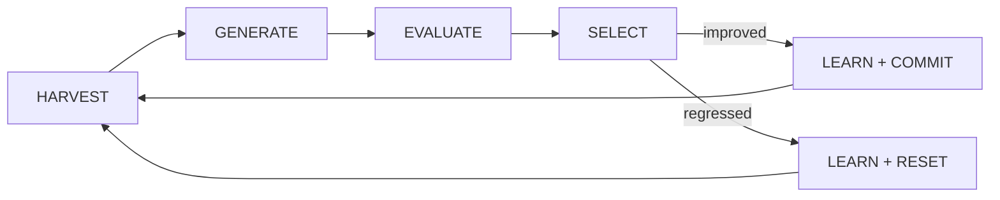
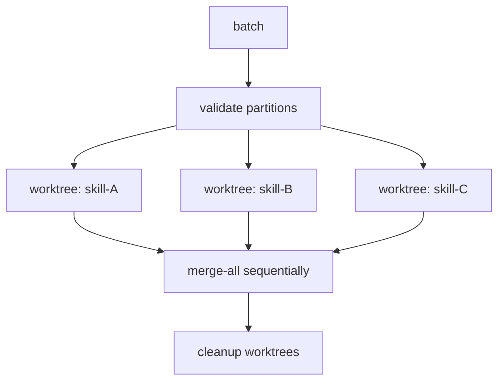

# God Mode: Autonomous Skill Self-Improvement

## Quick Start

```bash
# Single skill — one iteration
python3 execution/god_mode.py run --skill skills/my-skill

# All skills — batch mode
python3 execution/god_mode.py batch --skills-dir skills/

# Check status of last run
python3 execution/god_mode.py status --skill skills/my-skill
```

## Goal

Run the Karpathy AutoResearch loop autonomously — 24/7, no human intervention. Each cycle harvests learnings from failed attempts, generates a challenger SKILL.md, evaluates it with binary assertions, and either commits (improvement) or resets (regression). Named "God Mode" because once started, it self-improves indefinitely.

## The WD39 Philosophy

WD-40 succeeded on its 40th attempt. The first 39 "failures" were essential data. God Mode operates the same way: every rejected challenger teaches the system what NOT to do. Failed attempts are appended to `resource.md`, compounding learnings so the system never repeats the same mistake. Iteration 30 is smarter than iteration 1 because it has 29 failures as negative examples.

## Three Mandatory Ingredients

| Ingredient | Implementation | Without It |
|---|---|---|
| **Objective metric** | `eval/evals.json` — binary assertions only | No way to measure progress |
| **Automated measurement** | `parallel_eval.py` — runs N evals for statistical reliability | Noisy results, false positives |
| **Variable to change** | `SKILL.md` — the asset being optimized | Nothing to improve |

## The Loop



### Phase 1: HARVEST — Gather Context

```bash
python3 execution/run_skill_eval.py --evals skills/<name>/eval/evals.json --verbose
```

Read current SKILL.md, resource.md (past failures), and failing assertions. This is the challenger's input context.

### Phase 2: GENERATE — Create Challenger

The agent reads the baseline SKILL.md + all accumulated learnings in resource.md + the specific failing assertions, then produces a modified SKILL.md targeting the failures.

### Phase 3: EVALUATE — Measure Statistically

```bash
python3 execution/parallel_eval.py \
  --evals skills/<name>/eval/evals.json \
  --runs 5 \
  --output .tmp/eval_results.json
```

Minimum 5 parallel runs. Compare challenger pass rate vs. baseline pass rate.

### Phase 4: SELECT — Commit or Reset

| Condition | Action | Git Operation |
|---|---|---|
| `challenger > baseline` | Keep changes | `git commit -m "god-mode: improve <skill> N% → M%"` |
| `challenger <= baseline` | Discard changes | `git checkout HEAD -- SKILL.md` |
| `challenger == 100%` | Stop loop | Final commit, notify success |

### Phase 5: LEARN — Update Resource.md

Regardless of outcome, append what was tried and what happened to `skills/<name>/references/resource.md`. This is the compounding memory.

### Phase 6: NOTIFY — Report Results

Send Telegram notification (if configured) with iteration number, pass rate delta, and whether the challenger was accepted or rejected.

## Inputs

- `skills/<name>/SKILL.md` — the asset to optimize
- `skills/<name>/eval/evals.json` — binary assertions
- `skills/<name>/references/resource.md` — compounding learnings (created automatically)
- `.env` — optional: `TELEGRAM_BOT_TOKEN`, `TELEGRAM_CHAT_ID`

## Eval Design Anti-Patterns

| Anti-Pattern | Why It Fails | Correct Alternative |
|---|---|---|
| Likert scales (1-7) | Not binary, not automatable | `contains` / `not_contains` |
| "Is it good?" | Subjective, non-deterministic | `max_words: 300`, `regex_match` |
| Overly strict word counts | Causes parroting / padding | Use ranges: `min_words` + `max_words` |
| Single eval run | Noisy LLM outputs cause flaky results | `parallel_eval.py --runs 5` minimum |

Supported assertion types: `contains`, `not_contains`, `max_words`, `min_words`, `max_lines`, `min_lines`, `regex_match`, `regex_not_match`, `starts_with`, `ends_with`, `has_yaml_frontmatter`, `no_consecutive_blank_lines`, `max_chars`, `min_chars`, `contains_all`, `contains_any`, `line_count_equals`, `no_trailing_whitespace`.

## Resource.md Structure

Each failed/successful attempt appends a block:

```markdown
## Iteration 7 — 2026-03-22T14:30:00Z — REJECTED
- **Tried**: Shortened the routing table to reduce word count
- **Result**: 65% → 55% (regression)
- **Lesson**: Routing table is load-bearing — do not compress it
- **Failing assertions**: max_words (passed), contains "## Output" (failed)

## Iteration 8 — 2026-03-22T14:35:00Z — ACCEPTED
- **Tried**: Added "## Output" section header, kept routing table intact
- **Result**: 55% → 75% (improvement)
- **Lesson**: Missing section headers cause structural assertion failures
```

## Scheduling Options

| Method | Command |
|---|---|
| **Local** | `/loop 5m python3 execution/god_mode.py run --skill skills/my-skill` |
| **Cron** | `*/5 * * * * cd /path && python3 execution/god_mode.py run --skill skills/my-skill >> .tmp/god_mode.log 2>&1` |
| **GitHub Actions** | Use `schedule` cron trigger in a workflow calling `god_mode.py run` |

## Batch Mode with Worktree Parallelism

Run God Mode on ALL skills simultaneously, each in an isolated git worktree:

```bash
# Sequential batch (safe, simple)
python3 execution/god_mode.py batch --skills-dir skills/

# Parallel batch with worktree isolation
python3 execution/god_mode.py batch --skills-dir skills/ --parallel
```

Parallel mode uses `execution/worktree_isolator.py` to give each skill its own worktree:



```bash
# Manual worktree control
python3 execution/worktree_isolator.py create --agent god-mode-skillA --run-id gm-001
python3 execution/worktree_isolator.py merge --agent god-mode-skillA --run-id gm-001
python3 execution/worktree_isolator.py cleanup --agent god-mode-skillA --run-id gm-001
```

## Notification Setup

Add to `.env`:

```
TELEGRAM_BOT_TOKEN=your-bot-token
TELEGRAM_CHAT_ID=your-chat-id
```

Notifications fire on: iteration complete (accepted/rejected), loop finished (perfect score), loop aborted (max iterations), errors.

## Outputs

- Updated `SKILL.md` files (committed to git on improvement)
- Updated `references/resource.md` (compounding learnings)
- Eval results in `.tmp/eval_results.json`
- Memory stored in Qdrant via `memory_manager.py`
- Telegram notifications (if configured)

## When to Use / When NOT to Use

| Use | Do NOT Use |
|---|---|
| New skill with evals — bootstrap 0% to 100% | Skills without `eval/evals.json` |
| Skill quality degraded after upstream changes | Subjective/creative skills (no binary metrics) |
| Overnight optimization runs | During active human development |
| Pre-release batch verification | Skills with side effects in evals (API calls, writes) |

## Edge Cases

- **Stuck at local maximum**: 5+ iterations with no improvement halts the loop. Redesign evals or resource.md.
- **Flaky evals**: Increase `--runs` to 10+. Remove inherently noisy assertions.
- **Git conflicts in batch**: Worktree isolation prevents this; without worktrees, batch runs sequentially.
- **Disk space**: Clean up worktrees with `worktree_isolator.py cleanup` after runs.

> For deep dives on eval design, see `skill-creator/SKILL_skillcreator.md` Step 8.
> For worktree mechanics, see `docs/agent-teams/README.md`.