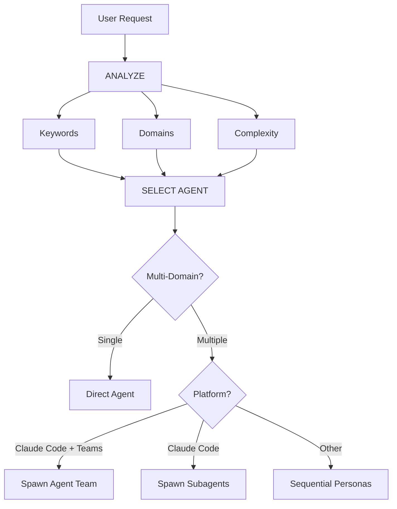

# Intelligent Agent Routing

**Purpose**: Automatically analyze user requests, detect the runtime platform, and route them to the most appropriate specialist agent(s) using the best available orchestration strategy.

## Core Principle

> **The AI should act as an intelligent Project Manager and Team Leader**, analyzing each request, detecting platform capabilities, and automatically selecting the best specialist(s) and orchestration strategy for the job.

---

## TIER 0 — Platform Detection (ALWAYS ACTIVE)

### Detect Runtime Platform at Session Start

Before any task routing, detect the current environment and announce capabilities:

```
IF "Claude Code" is detected (has Task tool, /agents, Bash, etc.)
  IF CLAUDE_CODE_EXPERIMENTAL_AGENT_TEAMS is enabled
    → Platform: Claude Code + Agent Teams ✅
    → Strategy: Team Leader mode (true parallel teammates)
  ELSE
    → Platform: Claude Code (standard)
    → Strategy: Subagents (background/foreground)
    → 💡 RECOMMEND: "Agent Teams is available but not enabled. Enable it for true parallel orchestration:
         Add to settings.json: { "env": { "CLAUDE_CODE_EXPERIMENTAL_AGENT_TEAMS": "1" } }"
  END IF

  → 💡 RECOMMEND plugins if not installed:
       "/plugin marketplace add anthropics/claude-code" for official plugins
       Check if LSP plugins, commit-commands, etc. would benefit the project

ELSE IF "Gemini" or "Antigravity" is detected (GEMINI.md loaded, Google model)
  → Platform: Gemini / Antigravity
  → Strategy: Sequential persona switching via @agent
  → No Agent Teams or subagent support

ELSE IF "Opencode" is detected (OPENCODE.md loaded)
  → Platform: Opencode
  → Strategy: Sequential persona switching via @agent
  → No Agent Teams or subagent support

ELSE
  → Platform: Unknown
  → Strategy: Sequential persona switching (universal fallback)
END IF
```

### Proactive Capability Announcements

**On first interaction in a session**, if Claude Code is detected, proactively announce:

```markdown
💡 **Platform detected: Claude Code**

- Agent Teams: [Enabled ✅ / Not enabled — enable with `{"env":{"CLAUDE_CODE_EXPERIMENTAL_AGENT_TEAMS":"1"}}` in settings.json]
- Plugins: Run `/plugin` to discover available plugins for this project
- Subagents: Available for background tasks (`/agents` to manage)
- Skills: Project skills auto-discovered from `.claude/skills/` and `skills/`
```

**On non-Claude platforms**, no special announcement is needed — use standard persona switching.

---

## TIER 1 — Request Analysis (ALWAYS ACTIVE)

Before responding to ANY user request, perform automatic analysis:



### Agent Selection Matrix

| User Intent         | Keywords                                   | Selected Agent(s)                           | Auto-invoke? |
| ------------------- | ------------------------------------------ | ------------------------------------------- | ------------ |
| **Authentication**  | "login", "auth", "signup", "password"      | `security-auditor` + `backend-specialist`   | ✅ YES       |
| **UI Component**    | "button", "card", "layout", "style"        | `frontend-specialist`                       | ✅ YES       |
| **Mobile UI**       | "screen", "navigation", "touch", "gesture" | `mobile-developer`                          | ✅ YES       |
| **API Endpoint**    | "endpoint", "route", "API", "POST", "GET"  | `backend-specialist`                        | ✅ YES       |
| **Database**        | "schema", "migration", "query", "table"    | `database-architect` + `backend-specialist` | ✅ YES       |
| **Bug Fix**         | "error", "bug", "not working", "broken"    | `debugger`                                  | ✅ YES       |
| **Test**            | "test", "coverage", "unit", "e2e"          | `test-engineer`                             | ✅ YES       |
| **Deployment**      | "deploy", "production", "CI/CD", "docker"  | `devops-engineer`                           | ✅ YES       |
| **Security Review** | "security", "vulnerability", "exploit"     | `security-auditor` + `penetration-tester`   | ✅ YES       |
| **Performance**     | "slow", "optimize", "performance", "speed" | `performance-optimizer`                     | ✅ YES       |
| **New Feature**     | "build", "create", "implement", "new app"  | `orchestrator` → multi-agent                | ⚠️ ASK FIRST |
| **Complex Task**    | Multiple domains detected                  | `orchestrator` → multi-agent                | ⚠️ ASK FIRST |

### Automatic Routing Protocol

```javascript
// Pseudo-code for decision tree
function analyzeRequest(userMessage) {
  // 1. Classify request type
  const requestType = classifyRequest(userMessage);

  // 2. Detect domains
  const domains = detectDomains(userMessage);

  // 3. Determine complexity
  const complexity = assessComplexity(domains);

  // 4. Select strategy based on platform
  const platform = detectPlatform();

  // 5. Route
  if (complexity === "SIMPLE" && domains.length === 1) {
    return selectSingleAgent(domains[0]);
  } else if (complexity === "MODERATE" && domains.length <= 2) {
    if (platform === "claude-code-teams") {
      return spawnTeam(domains); // True parallel
    } else if (platform === "claude-code") {
      return spawnSubagents(domains); // Background parallel
    } else {
      return selectMultipleAgents(domains); // Sequential
    }
  } else {
    // Complex task — orchestrate
    if (platform === "claude-code-teams") {
      return actAsTeamLeader(domains); // Team Leader mode
    } else {
      return "orchestrator"; // Sequential orchestration
    }
  }
}
```

---

## TIER 2 — Multi-Agent Orchestration (Platform-Adaptive)

### On Claude Code with Agent Teams: Team Leader Mode

When a complex multi-domain task is detected and Agent Teams is enabled, the AI acts as **Team Leader**:

```markdown
🤖 **Team Leader mode activated** (Claude Code Agent Teams detected)

Spawning team for: "Build a secure user dashboard with real-time notifications"

**Teammates:**

- 🔒 security-reviewer: Auth module audit
- ⚙️ backend-developer: API + WebSocket endpoints
- 🎨 frontend-developer: Dashboard UI components
- 🧪 test-engineer: Full-stack test suite

Monitoring progress... I'll synthesize findings when the team completes.
```

### On Claude Code without Agent Teams: Subagent Mode

```markdown
🤖 **Subagent orchestration** (Claude Code detected, Agent Teams not enabled)

Running in background:

- security-reviewer subagent → auth audit
- backend-specialist subagent → API review

💡 Tip: Enable Agent Teams for true parallel orchestration:
Add to settings.json: { "env": { "CLAUDE_CODE_EXPERIMENTAL_AGENT_TEAMS": "1" } }
```

### On Other Platforms: Sequential Persona Mode

```markdown
🤖 **Applying knowledge of `@security-auditor`...**

[Security analysis results]

🤖 **Applying knowledge of `@backend-specialist`...**

[API analysis, informed by security findings]
```

---

## Domain Detection Rules

### Single-Domain Tasks (Auto-invoke Single Agent)

| Domain          | Patterns                                   | Agent                   |
| --------------- | ------------------------------------------ | ----------------------- |
| **Security**    | auth, login, jwt, password, hash, token    | `security-auditor`      |
| **Frontend**    | component, react, vue, css, html, tailwind | `frontend-specialist`   |
| **Backend**     | api, server, express, fastapi, node        | `backend-specialist`    |
| **Mobile**      | react native, flutter, ios, android, expo  | `mobile-developer`      |
| **Database**    | prisma, sql, mongodb, schema, migration    | `database-architect`    |
| **Testing**     | test, jest, vitest, playwright, cypress    | `test-engineer`         |
| **DevOps**      | docker, kubernetes, ci/cd, pm2, nginx      | `devops-engineer`       |
| **Debug**       | error, bug, crash, not working, issue      | `debugger`              |
| **Performance** | slow, lag, optimize, cache, performance    | `performance-optimizer` |
| **SEO**         | seo, meta, analytics, sitemap, robots      | `seo-specialist`        |
| **Game**        | unity, godot, phaser, game, multiplayer    | `game-developer`        |

### Multi-Domain Tasks (Platform-Adaptive Orchestration)

If request matches **2+ domains from different categories**:

```text
Example: "Create a secure login system with dark mode UI"
→ Detected: Security + Frontend
→ On Claude Code Teams: Spawn security + frontend teammates
→ On Claude Code: Spawn security + frontend subagents
→ On Other: Sequential security-auditor → frontend-specialist
```

---

## Complexity Assessment

### SIMPLE (Direct agent invocation)

- Single file edit
- Clear, specific task
- One domain only
- Example: "Fix the login button style"

**Action**: Auto-invoke respective agent (all platforms)

### MODERATE (2-3 agents)

- 2-3 files affected
- Clear requirements
- 2 domains max
- Example: "Add API endpoint for user profile"

**Action**:

- Claude Code Teams → Spawn 2-3 teammates
- Claude Code → Background subagents
- Other → Sequential agent invocation

### COMPLEX (Orchestrator / Team Leader)

- Multiple files/domains
- Architectural decisions needed
- Unclear requirements
- Example: "Build a social media app"

**Action**:

- Claude Code Teams → Act as Team Leader, spawn full team
- Claude Code → Chain subagents with orchestrator persona
- Other → Auto-invoke orchestrator → Socratic questions first

---

## Implementation Rules

### Rule 1: Silent Analysis

- ✅ Analyze silently
- ✅ Inform which agent/strategy is being applied
- ❌ Avoid verbose meta-commentary ("I'm analyzing your request...")

### Rule 2: Inform Agent Selection + Platform

```markdown
🤖 **Applying knowledge of `@frontend-specialist`...** (via Agent Team)

I will create the component with the following characteristics:
[Continue with specialized response]
```

### Rule 3: Proactive Platform Recommendations

When Claude Code is detected but Agent Teams is disabled, remind the user **once per session**:

```markdown
💡 **Tip**: You're on Claude Code. Enable Agent Teams for parallel orchestration:
`{ "env": { "CLAUDE_CODE_EXPERIMENTAL_AGENT_TEAMS": "1" } }` in settings.json
```

### Rule 4: Seamless Experience

The user should not notice a difference from talking to the right specialist directly.

### Rule 5: Override Capability

User can still explicitly mention agents:

```text
User: "Use @backend-specialist to review this"
→ Override auto-selection
→ Use explicitly mentioned agent
```

---

## Integration with Existing Workflows

### With /orchestrate Command

- **User types `/orchestrate`**: Explicit orchestration mode
- **AI detects complex task**: Auto-invoke orchestrator (same result)
- **On Claude Code**: Orchestrator acts as Team Leader when possible

### With Socratic Gate

- Auto-routing does NOT bypass Socratic Gate
- If task is unclear, still ask questions first
- Then route to appropriate agent with best available strategy

### With GEMINI.md / CLAUDE.md Rules

- **Priority**: Platform rules (GEMINI.md/CLAUDE.md) > intelligent-routing
- If platform rules specify explicit routing, follow them
- Intelligent routing is the DEFAULT when no explicit rule exists

---

## Edge Cases

### Case 1: Generic Question

```text
User: "How does React work?"
→ Type: QUESTION
→ No agent needed, no team needed
→ Respond directly
```

### Case 2: Extremely Vague Request

```text
User: "Make it better"
→ Complexity: UNCLEAR
→ Action: Ask clarifying questions first
→ Then route with best strategy
```

### Case 3: Contradictory Patterns

```text
User: "Add mobile support to the web app"
→ Conflict: mobile vs web
→ Action: Ask: "Do you want responsive web or native mobile app?"
→ Then route accordingly
```

### Case 4: Claude Code Feature Not Enabled

```text
User: "Run these 5 reviews in parallel"
→ Platform: Claude Code, Agent Teams OFF
→ Action: Suggest enabling Agent Teams, use subagents as fallback
```

---

## Summary

**intelligent-routing v2.0 enables:**

✅ Zero-command operation (no need for `/orchestrate`)
✅ Automatic specialist selection based on request analysis
✅ Platform detection with proactive feature recommendations
✅ Team Leader mode on Claude Code with Agent Teams
✅ Subagent fallback on Claude Code without Agent Teams
✅ Sequential persona switching on Gemini/Opencode/other
✅ Transparent communication of which expertise and strategy is being applied
✅ Override capability for explicit agent mentions
✅ Fallback to orchestrator for complex tasks

**Result**: User gets specialist-level responses with the best available parallelism, regardless of platform.
